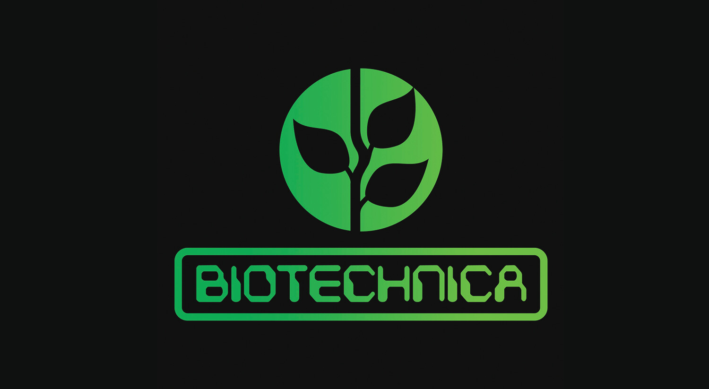
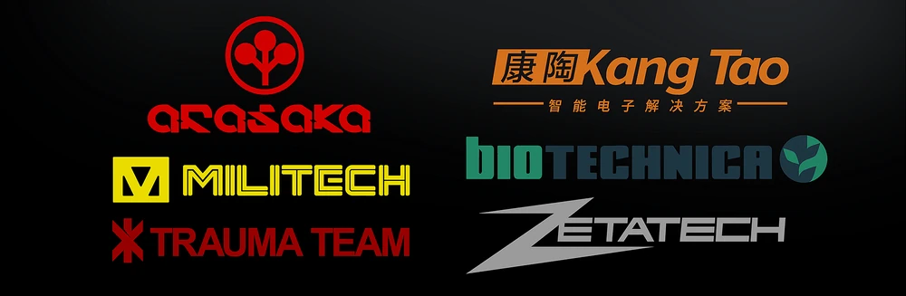
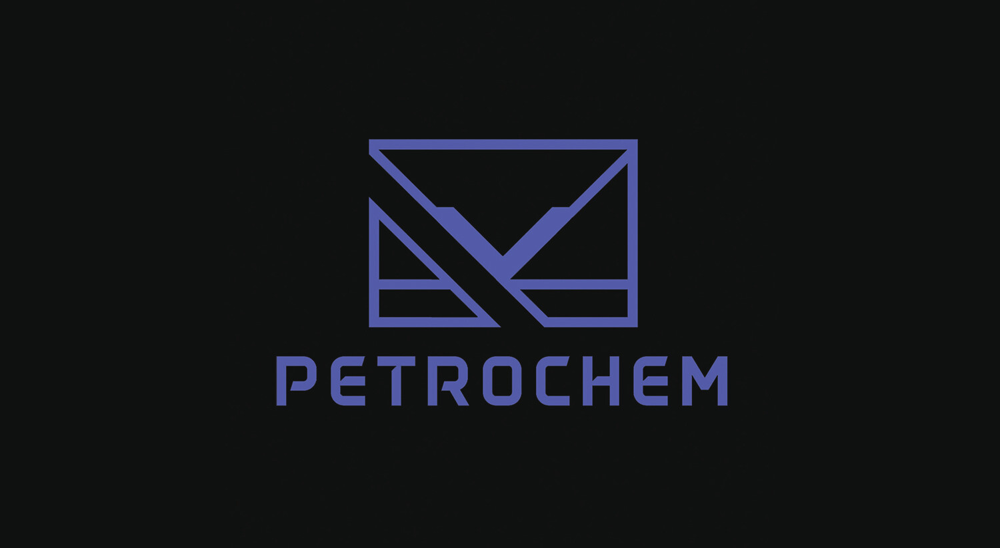
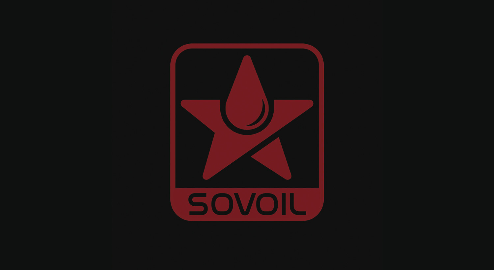
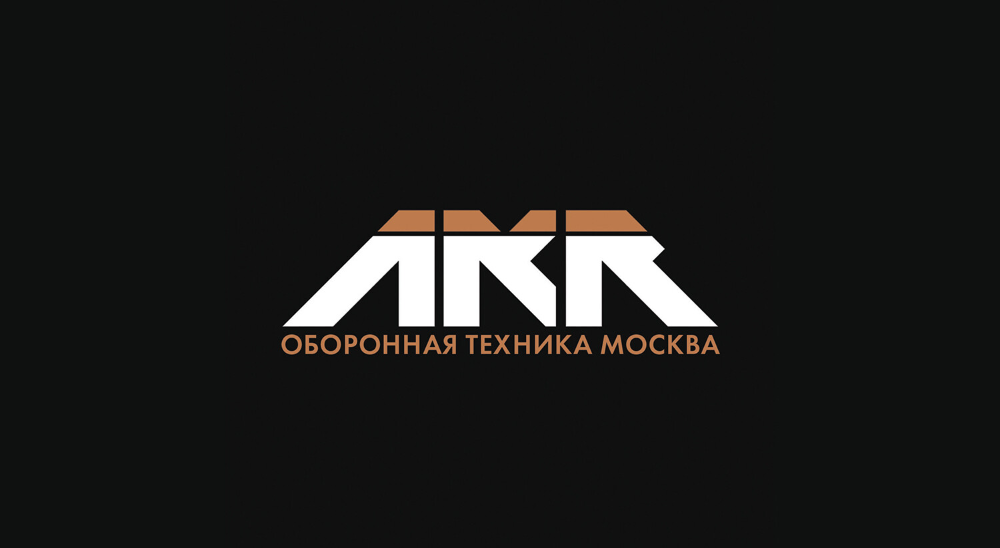
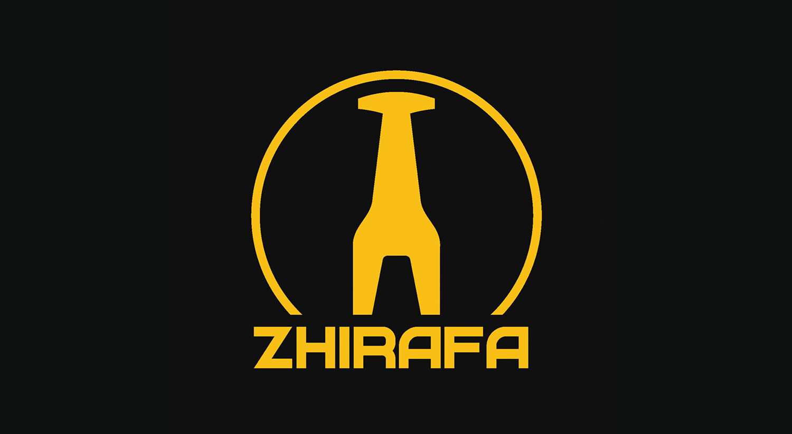
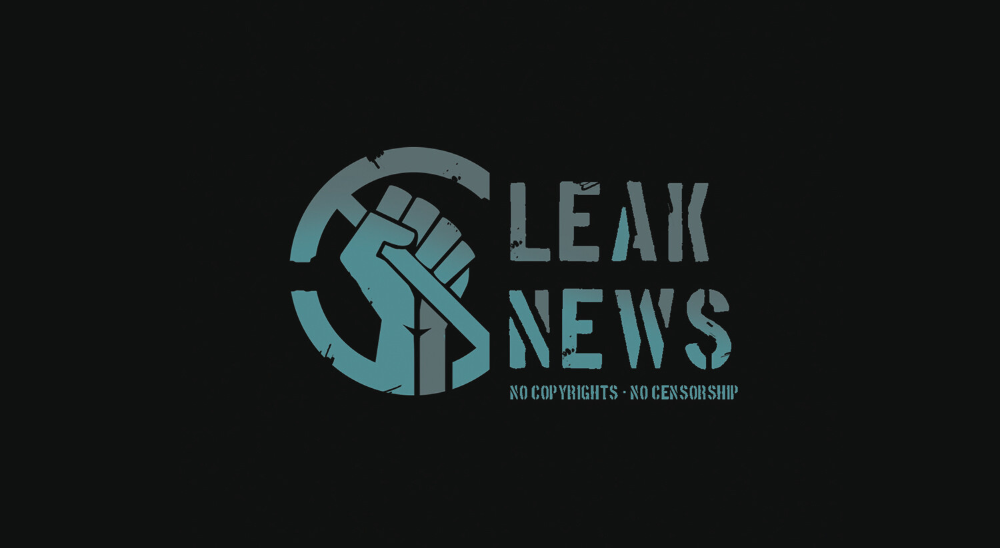
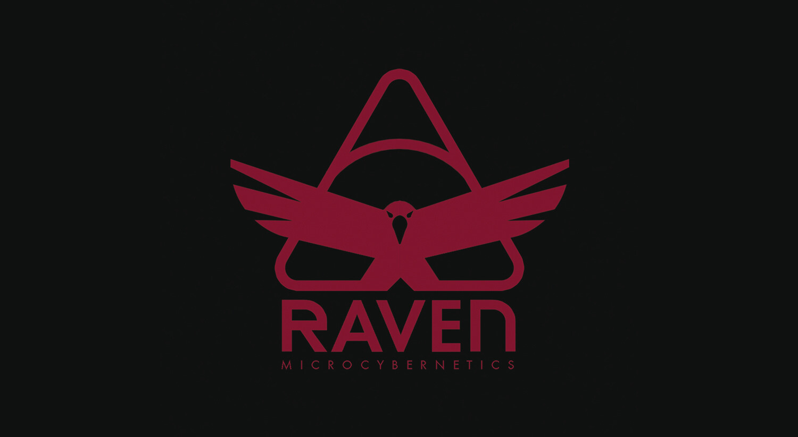
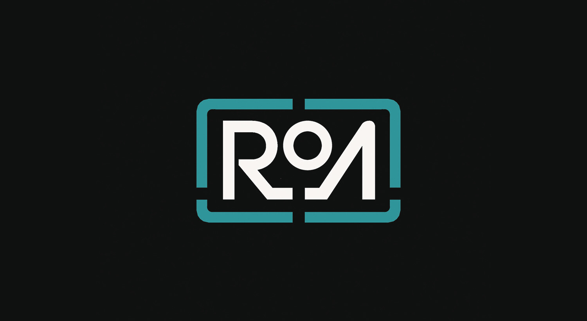

# (WORK IN PROGRESS) BIOTECHNICA-ACTIVE-DIRECTORY-LAB
Idea to create an automated, immersive Active Directory lab environment themed around Cyberpunk 2077's Biotechnica corporation.
Features PowerShell infrastructure-as-code deployment, RBAC group provisioning, and security hardening. (See Diagram)

## End Goal to create a project for each Cyberpunk 2077 Mega Corporation:

## Maybe these corporations also:

